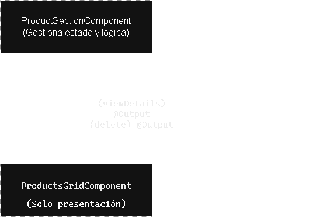

# Tech Test Angular - 🌎WorldMart
Sistema de Gestión de Productos.

Una aplicación moderna construida con Angular 19, que permite explorar, buscar y gestionar productos con una interfaz intuitiva y responsiva.

## 🚀 Características

- ✨ **Catálogo de Productos**: Visualización en grid con imágenes lazy-loaded
- 🔍 **Búsqueda Avanzada**: Búsqueda en tiempo real con debounce
- 🏷️ **Filtrado por Categorías**: Navegación rápida por categorías
- 📱 **Diseño Responsivo**: Optimizado para móviles, tablets y desktop
- 👤 **Modo Administrador**: Gestión CRUD de productos
- 🎨 **Material Design**: UI moderna con Angular Material

## 📋 Requisitos Previos

- **Node.js**: v18.18.0 o superior
- **npm**: 9.x o superior
- **Angular CLI**: 19.2.18

## 🛠️ Instalación

1. **Clonar el repositorio**
   ```bash
   git clone <repository-url>
   cd tech-test-angular
   ```

2. **Instalar dependencias**
   ```bash
   npm install
   ```

## 🎯 Comandos Disponibles

### Desarrollo
```bash
# Iniciar servidor de desarrollo (http://localhost:4200)
npm start
# o
ng serve

# Desarrollo con SSR
npm run serve:ssr:tech-test-angular
```

## Arquitectura de la Aplicación
### 📋 Índice
- Estado
- Componentes
- Servicios
- Modelos

### Estado
Se emplea un sistema de gestión de estado reactivo basado en RxJS, sin necesidad de librerías externas como NgRx o Akita.
##### Servicios de Estado Global
##### AppStateService (app-state.service.ts)
Maneja el estado global de la aplicación, incluyendo:
- **Autenticación**: Control de usuario administrador (isAdmin signal)
- **Estado de sesión**: Persistencia y gestión de credenciales
- **Configuración global**: Preferencias y ajustes de la aplicación
##### AppEventsService (app-events.service.ts)
Sistema de mensajería entre componentes mediante Subjects de RxJS:
- **productMutate$**: Observable que emite eventos cuando se crea, actualiza o elimina un producto
- Permite comunicación desacoplada entre componentes sin dependencias directas
- Facilita la actualización reactiva de la UI ante cambios en los datos
##### Estado Local de Componentes
Cada componente inteligente mantiene su propio estado reactivo mediante:
- **BehaviorSubjects**: Para valores que necesitan estado inicial (ej: pageIndex, reload)
- **FormControls**: Para inputs del usuario con reactividad automática (ej: searchCtrl, categoryCtrl)
- **Streams combinados**: Uso de operadores RxJS (combineLatest, switchMap, shareReplay) para derivar estado

**Ejemplo del componente de productos:**
```code
  // Estado de paginación
readonly pageIndex$ = new BehaviorSubject<number>(0);

// Stream derivado que combina múltiples fuentes
readonly vm$ = combineLatest([
  this.search$,
  this.category$,
  this.pageIndex$,
  this.reload$
]).pipe(
  switchMap(),
  startWith({ products: [], total: 0, loading: true }),
  shareReplay({ bufferSize: 1, refCount: true })
);
   ```

### Componentes
Se establece una arquitectura de componentes inteligentes y presentacionales.
### Tipos de Componentes
##### Smart Components (Contenedores)
Componentes que gestionan lógica y estado:
- **ProductsSectionComponent**:
  - Orquesta la lista de productos
  - Maneja filtros (búsqueda y categoría)
  - Controla paginación
  - Gestiona diálogos y eventos de CRUD
  - Utiliza ChangeDetectionStrategy.OnPush para optimización
##### Presentational Components (UI)
Componentes básicos que solo reciben datos y emiten eventos:
- **ProductsGridComponent** (products-grid.component.ts):
  - Recibe lista de productos via @Input()
  - Emite eventos via @Output(): viewDetails, delete
  - No contiene lógica de negocio
  - Enfocado únicamente en presentación
##### Dialogs (Modales)
Componentes especializados para interacciones modales:
- **ProductDetailDialogComponent**: Visualización detallada de un producto
- **ProductNewDialogComponent**: Creación/edición de productos (admin)

### Comunicación entre componentes


### Servicios
Los servicios encapsulan la lógica de negocio y comunicación con APIs.
#### ProductsApi (product.api.ts)
Servicio principal para operaciones CRUD de productos:
##### Métodos Principales
```code
   // Lectura
getProducts(params): Observable<ProductsResponse>
getProductsByCategory(category, params): Observable<ProductsResponse>
searchProducts(query, params): Observable<ProductsResponse>
getProductById(id): Observable<Product>
getCategories(): Observable<Category[]>

// Escritura (Admin)
createProduct(data): Observable<Product>
deleteProduct(id): Observable<DeletedProduct>
   ```
#### Características
- **HttpClient** de Angular para peticiones HTTP
- Retorna **Observables** para composición reactiva
- Maneja parámetros de paginación (`limit`, `skip`)
- Integración con API REST externa (DummyJSON)
- Tipos fuertemente tipados (TypeScript)

### Patrón de Uso
```code
   this.api.getProducts({ limit: this.pageSize, skip }).pipe(
        map(res => <ListVm>{ products: res.products, total: res.total, loading: false }),
        catchError(() => of(<ListVm>{ products: [], total: 0, loading: false, error: 'No se pudo cargar productos.' }))
      );
   ```
### Modelos
Definiciones de tipos TypeScript que garantizan seguridad de tipos en toda la aplicación.
##### Product Model (product.model.ts)
```code
export interface Product {
      id: number;
      title: string;
      description: string;
      category: string;
      price: number;
      discountPercentage: number;
      rating: number;
      stock: number;
      brand: string;
      thumbnail: string;
      images: string[];
      reviews?: Review[];
}
   ```
#### Modelos auxiliares
 ```code
export type Category = {
  slug: string;
  name: string;
  url?: string
};

export interface ReviewUser {
  id?: number;
  username: string;
}
   ```
### ViewModels (VM)
Tipos específicos para representar el estado de la UI:
```code
interface ListVm {
  products: Product[];
  total: number;
  loading: boolean;
  error?: string;
}
   ```

